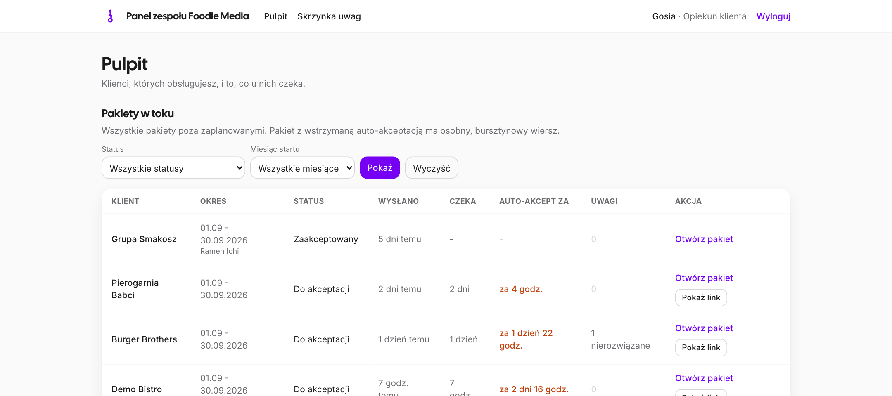
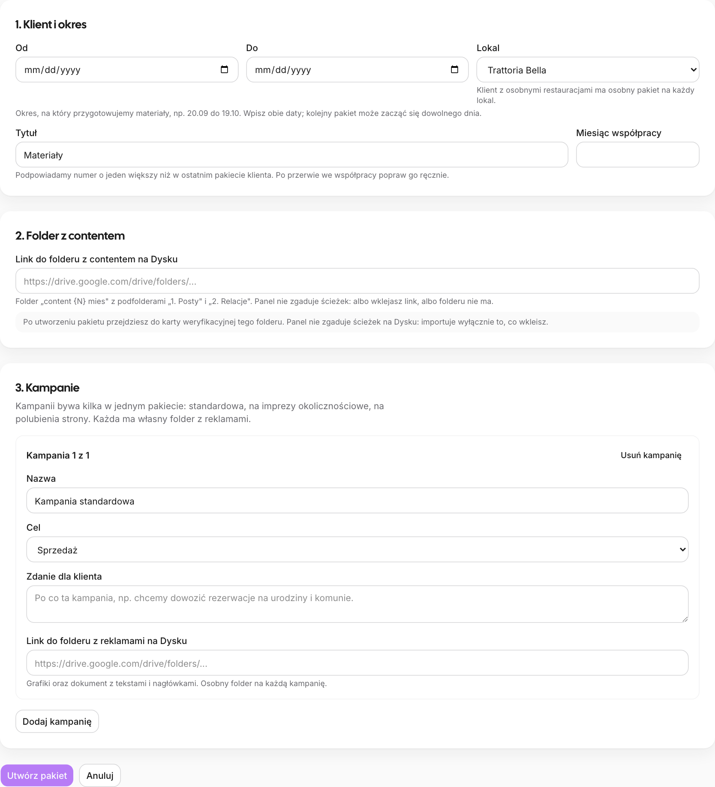
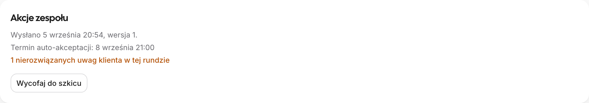
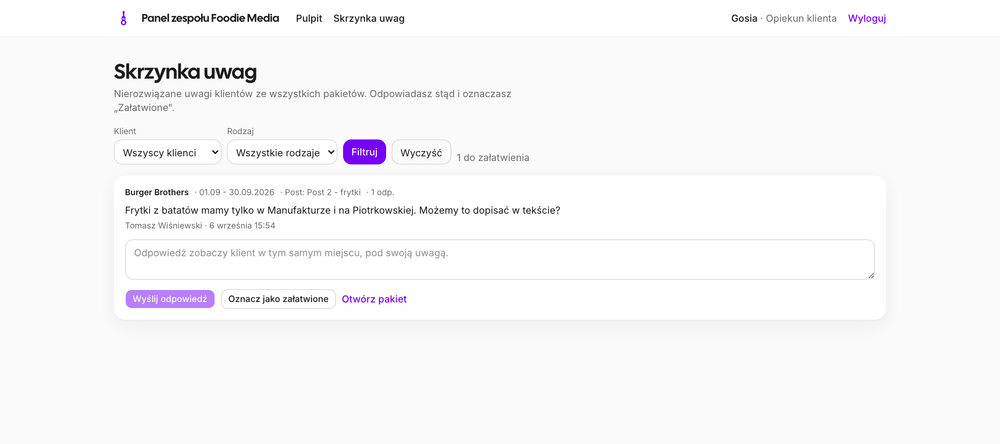
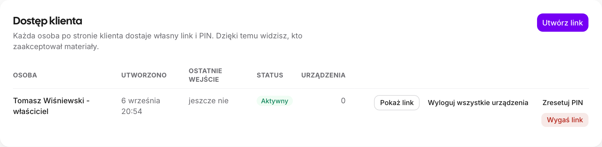
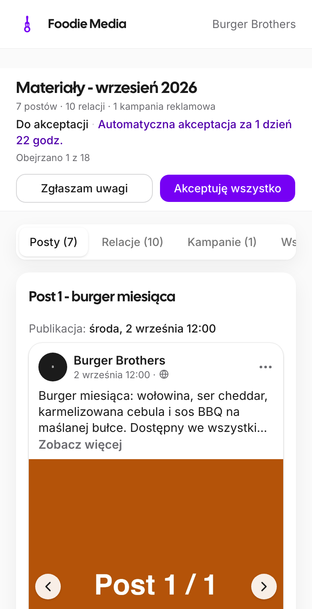

# Panel klienta Foodie Media: ściąga dla Gosi i content creatorów

Panel: **panel.foodiemedia.pl/zespol**. Logujesz się adresem e-mail i kodem z maila (bez hasła).
Klient dostaje od nas link i PIN, ogląda materiały w podglądzie 1:1 i klika **„Akceptuję wszystko"** albo
**„Zgłaszam uwagi"**. Bez decyzji materiały akceptują się same po **72 godzinach**. Panel niczego nie publikuje
na Facebooku: publikuje człowiek w Meta Business Suite.

## 1. Pulpit: co widzisz rano

- **Pakiety w toku**: kto czeka, od kiedy, ile zostało do auto-akceptacji. Kolory jak w Bazie Klientów:
  niebieski 6 do 7 dni, żółty 4 do 5, pomarańczowy 1 do 3, czerwony dziś, szary po terminie.
- **Bursztynowy wiersz „Auto-akceptacja wstrzymana"**: termin minął, ale klient ma nierozwiązane uwagi.
  Odpowiedz na nie i oznacz „Załatwione", inaczej pakiet nie zostanie zatwierdzony.
- **„Pokaż link"** przy pakiecie do akceptacji: adres do ponownego wysłania klientowi (bez PIN-u).

## 2. Content creator: nowy pakiet w pięciu krokach

1. Karta klienta → **Materiały → „Nowy pakiet"**. Wpisz **okres od-do** (np. 20.09 do 19.10). Klient
   kategorii 1 ma osobny pakiet na każdy lokal.
2. Wklej **link do folderu `content {N} mies`** z Dysku (ten z „1. Posty" i „2. Relacje"). Panel nie zgaduje
   ścieżek: importuje tylko to, co wkleisz.
3. **„Dodaj kampanię"** dla każdej kampanii: nazwa, cel, notatka dla klienta i link do jej folderu z reklamami.
4. **Karta weryfikacyjna**: przeczytaj ostrzeżenia (inny klient w nazwie folderu, inny miesiąc, folder użyty już
   w innym pakiecie). To jedyne zabezpieczenie przed materiałami z innego miesiąca.
5. **Mapowanie**: potwierdź, która grafika ma który opis, i uruchom kopiowanie. Potem uzupełnij **daty
   publikacji** (bez nich wysyłka jest zablokowana) i złóż warianty reklam.

Pojedynczy plik: **„Dodaj materiał"** (z komputera albo linkiem do pliku na Dysku). Podmiana: narzędzia przy
materiale; stary plik nigdy nie znika.

## 3. Gosia: wysyłka, uwagi, wersja 2

1. W pakiecie **„Wyślij do akceptacji"**. Panel pokaże braki (daty, opisy) i ostrzeżenia (brak kampanii).
2. Wyślij klientowi **link i PIN** na WhatsAppie (punkt 4). Panel nie wysyła nic sam.
3. Uwagi klienta czytasz przy materiale albo w **Skrzynce uwag**; odpowiadasz tam samo, „Załatwione" zamyka
   wątek. Po poprawkach **„Wyślij wersję 2"**: licznik startuje od nowa, klient widzi plakietki „Poprawione".
4. Po akceptacji ustaw publikacje w Meta Business Suite i kliknij **„Zaplanowano"**. Zmiana materiału
   w zaakceptowanym pakiecie wymaga potwierdzenia i pokazuje klientowi baner.

## 4. Link i PIN dla klienta

- Karta klienta → **Dostęp → „Utwórz link"**: osobny link dla każdej osoby (wiemy, kto zaakceptował).
  **PIN widzisz tylko raz**: skopiuj „Link i PIN" i wyślij klientowi. Wiadomość piszesz sam.
- **„Zresetuj PIN"**: nowy PIN (widoczny raz), stare urządzenia wylogowane, blokady wyczyszczone.
- **„Wygaś link"**: nieodwracalne; potem tworzysz nowy.

**Klient mówi, że link nie działa?** Najczęściej: (1) zły PIN, po 5 próbach blokada na 15 minut, po 10 w godzinę
na dobę; najszybciej pomaga „Zresetuj PIN". (2) Stary, wygaszony link: utwórz nowy. (3) Link otwarty
w przeglądarce w aplikacji (Messenger): niech otworzy w Safari albo Chrome. Ekran PIN celowo nie mówi,
co jest nie tak. Historia logowań jest pod listą linków. Reszta: Szymon, z godziną próby.

## 5. Jak to widzi klient

Klient otwiera panel z WhatsAppa, na telefonie. Widzi posty, relacje i reklamy tak, jak będą wyglądać na
Facebooku i Instagramie, może komentować każdy materiał i wariant reklamy. **„Zobacz jak klient"** na karcie
klienta pokazuje Ci dokładnie ten widok (tylko do odczytu). Klient nie widzi logo agencji w podglądach ani
Twoich notatek wewnętrznych. Nic nie kasuje się samo: pakiety starsze niż dwa lata zgłasza cron, decyduje
Szymon.
